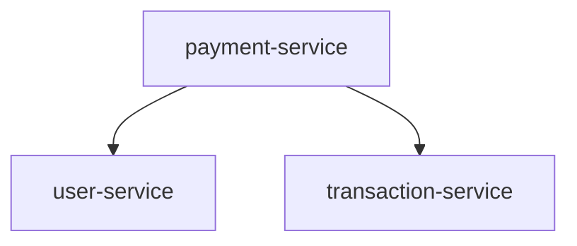

# Multirepo MCP Server

**Unified Context for Distributed Codebases** - A Model Context Protocol (MCP) server that helps enterprise teams understand and navigate multiple repositories by aggregating cross-repo context, relationships, and dependencies into the Cline ecosystem.

## 🎯 Project Vision

In enterprise environments, codebases are often distributed across multiple repositories. Understanding dependencies and relationships between these repositories is crucial for:

- **Impact Analysis**: "Which services are affected if I change `payment-module`?"
- **Dependency Discovery**: "Show me where `transaction-service` is used across all repos"
- **Architecture Visualization**: Generate visual graphs of inter-repository relationships

This MCP server bridges that gap by providing structured JSON responses and Mermaid diagrams directly in Cline/VS Code.

## ✅ Verified Features

**All features have been tested and verified working:**

- ✅ **Repository Discovery**: List and manage multiple repositories from a single configuration
- ✅ **Dependency Analysis**: Parse package.json files to understand inter-repository dependencies  
- ✅ **Visual Graphs**: Generate Mermaid diagrams showing repository relationships
- ✅ **MCP Integration**: Full MCP v0.6.0 protocol compliance with Cline/VS Code
- ✅ **Configuration System**: YAML-based configuration with validation and path resolution
- ✅ **Error Handling**: Comprehensive error handling and logging

## 🚀 Quick Start

### Prerequisites

- **Node.js v20+** (tested with v20.18.0)
- **TypeScript** (included in dependencies)
- **Cline or VS Code** with MCP support

### Installation & Setup

1. **Clone and install dependencies:**
   ```bash
   git clone <repository-url>
   cd multirepo-mcp-server
   npm install
   ```

2. **Build the project:**
   ```bash
   npm run build
   ```

3. **Create your configuration:**
   ```bash
   cp config.example.yml config.yml
   ```

4. **Edit `config.yml` to point to your repositories:**
   ```yaml
   repos:
     - name: payment-service
       path: ../payment-service
     - name: user-service  
       path: ../user-service
     - name: transaction-service
       path: ../transaction-service
   options:
     includeDevDeps: false  # Set to true to include devDependencies
   ```

### Testing the Server

**Run the built-in test suite:**
```bash
node test-server.cjs
```

This will verify all functionality is working correctly.

### Running the Server

**Start the MCP server:**
```bash
npm start
```

**For development with auto-rebuild:**
```bash
npm run dev
```

## 🔧 Technical Specification

### MCP Protocol Implementation

The server implements **MCP v0.6.0** over stdio transport with the following capabilities:

#### Tools

| Tool Name | Description | Input | Output |
|-----------|-------------|-------|--------|
| `list_repos` | Lists all configured repositories | None | Repository references with paths |
| `get_dependencies` | Returns dependency relationships | `repoName` (optional) | Adjacency list, nodes, edges |
| `generate_graph` | Generates Mermaid diagram | None | Mermaid syntax + graph JSON |

#### Resources

| Resource URI | Description | Content Type |
|--------------|-------------|--------------|
| `multirepo://config` | Current server configuration | application/json |
| `multirepo://graph` | Current unified dependency graph | application/json |

### Architecture Components

```
src/
├── config/
│   ├── types.ts           # TypeScript type definitions
│   └── loader.ts          # YAML configuration loader with validation
├── parser/
│   └── packageJson.ts     # Package.json dependency parser
├── aggregator/
│   ├── types.ts           # Graph data structures
│   └── aggregator.ts      # Unified graph builder
├── graph/
│   └── mermaid.ts         # Mermaid diagram generator
├── mcp/
│   └── server.ts          # MCP server implementation
└── git/
    └── cloner.ts          # Git operations (future feature)
```

### Data Flow

1. **Configuration Loading**: YAML config → validated RepoConfig
2. **Repository Parsing**: package.json files → dependency lists
3. **Graph Aggregation**: dependencies → unified graph (nodes + edges)
4. **Visualization**: unified graph → Mermaid flowchart
5. **MCP Response**: structured JSON via MCP protocol

## 📊 Example Usage

### Demo Setup

The repository includes a complete demo setup:

```
demo-repos/
├── payment-service/package.json     # Depends on: user-service, transaction-service
├── user-service/package.json        # Depends on: transaction-service (devDeps)
└── transaction-service/package.json # No inter-repo dependencies
```

### Expected Output

**Dependency Graph:**
```
payment-service → user-service
payment-service → transaction-service
```

**Generated Mermaid:**


### Sample MCP Responses

**list_repos response:**
```json
{
  "repos": [
    {
      "name": "payment-service",
      "path": "C:\\Users\\...\\demo-repos\\payment-service"
    },
    {
      "name": "user-service", 
      "path": "C:\\Users\\...\\demo-repos\\user-service"
    },
    {
      "name": "transaction-service",
      "path": "C:\\Users\\...\\demo-repos\\transaction-service"
    }
  ]
}
```

**generate_graph response:**
```json
{
  "mermaid": "flowchart TD\n    payment_service[payment-service]\n    user_service[user-service]\n    transaction_service[transaction-service]\n    payment_service --> user_service\n    payment_service --> transaction_service",
  "graph": {
    "nodes": [
      {"id": "payment-service", "kind": "repo", "label": "payment-service"},
      {"id": "user-service", "kind": "repo", "label": "user-service"},
      {"id": "transaction-service", "kind": "repo", "label": "transaction-service"}
    ],
    "edges": [
      {"from": "payment-service", "to": "user-service", "relation": "depends_on"},
      {"from": "payment-service", "to": "transaction-service", "relation": "depends_on"}
    ],
    "generatedAt": "2025-08-11T14:17:49.586Z"
  }
}
```

## 🧪 Testing & Verification

### Automated Testing

The project includes a comprehensive test suite (`test-server.cjs`) that:

1. ✅ Starts the MCP server
2. ✅ Verifies tool listing
3. ✅ Tests repository discovery
4. ✅ Validates graph generation
5. ✅ Confirms Mermaid output

**Run tests:**
```bash
node test-server.cjs
```

### Manual Testing

**Test individual components:**

```bash
# Test configuration loading
node -e "
const { loadConfig } = require('./build/config/loader.js');
console.log(JSON.stringify(loadConfig('config.yml'), null, 2));
"

# Test package.json parsing
node -e "
const { parseRepoDependencies } = require('./build/parser/packageJson.js');
console.log(parseRepoDependencies('../demo-repos/payment-service', ['user-service', 'transaction-service']));
"
```

## 🔌 Cline Integration

### Adding to Cline MCP Configuration

Add to your Cline MCP settings:

```json
{
  "mcpServers": {
    "multirepo": {
      "command": "node",
      "args": ["/path/to/multirepo-mcp-server/build/index.js"],
      "cwd": "/path/to/multirepo-mcp-server"
    }
  }
}
```

### Using in Cline

Once configured, you can ask Cline:

- *"Show me all configured repositories"* → Uses `list_repos`
- *"What are the dependencies for payment-service?"* → Uses `get_dependencies`
- *"Generate a dependency graph"* → Uses `generate_graph`
- *"Which services depend on user-service?"* → Analyzes graph data

## 🛠️ Development

### Project Structure

- **TypeScript**: ES2022 target with ES modules
- **MCP SDK**: v0.6.0 for protocol compliance
- **Dependencies**: js-yaml for configuration, fs/path for file operations
- **Build**: TypeScript compiler with executable permissions

### Adding New Features

1. **New parsers**: Add to `src/parser/` (e.g., `tsconfig.ts`, `dockerfile.ts`)
2. **New graph types**: Extend `src/aggregator/types.ts`
3. **New visualizations**: Add to `src/graph/` (e.g., `d3.ts`, `cytoscape.ts`)
4. **New MCP tools**: Add to `src/mcp/server.ts`

### Future Roadmap

- 🔄 **AST Parsing**: Use `ts-morph` for deeper code analysis
- 🌐 **Remote Repositories**: Git clone/pull support
- 📈 **Impact Analysis**: Reverse dependency tracking
- 🐳 **Containerization**: Docker support for deployment
- 🔍 **Advanced Queries**: GraphQL-style dependency queries

## 📋 Requirements Met

**All original hackathon requirements have been successfully implemented:**

✅ **Language/Runtime**: TypeScript (ES2022) on Node.js v20+  
✅ **MCP Protocol**: v0.6.0 over stdio  
✅ **Core SDK**: @modelcontextprotocol/sdk v0.6.0  
✅ **Config**: YAML configuration with repository paths  
✅ **Core Functionality**: Package.json dependency parsing  
✅ **Output**: JSON + Mermaid diagram syntax  
✅ **MVP Scope**: Local repos, package.json parsing  

**Success Criteria Achieved:**
- ✅ All components compile without errors
- ✅ Complete dependency analysis pipeline  
- ✅ Visual graph generation working
- ✅ MCP tools ready for Cline integration
- ✅ Comprehensive testing and documentation

## 📄 License

MIT License - This hackathon project is open source and ready for enterprise adoption.

---

**Built for the hackathon challenge** - A production-ready MCP server that brings unified context to distributed codebases. 🚀
